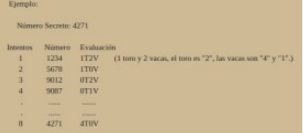

# Toros y Vacas, Laravel 11 API, documentada con Swagger.

Ejercicio realizado como prueba técnica para el puesto de Backend PHP Developer.

Se encuentra publicada una versión que usa:
* [Vercel](https://vercel.com/): Como plataforma de despliegue.
* [Supabase](https://supabase.com/): Como sistema gestor de base de dato en la nube basado en PostgreSQL. 

Para acceder a la aplicación pinche el siguiente acceso directo: [https://toros-vacas.vercel.app/](https://toros-vacas.vercel.app/).

#Instalación

1. Clone el proyecto en su entorno de trabajo:

```shell
git clone https://github.com/mriverog86/toros_vacas.git
```

2. Muevase dentro del directorio creado:

```shell
cd toros_vacas
```

3. Instale las dependencias del proyecto:

```shell
composer install
```

4. Genere la clave de la aplicación:

```shell
php artisan key:generate 
```
5. Abra el fichero `.env` y establezca el tiempo de duración del juego en segundos:

```yml
GAME_TIME = <TIEMPO_EN_SEGUNDOS>
```

6. Inicialice la base de datos:

```shell
php artisan migrate:fresh
```

6. Inicie el servidor de desarrollo:

```shell
php artisan serve
```

## Toros y Vacas

Toros y vacas es un juego tradicional inglés a lápiz y papel para dos jugadores cuyo objetivo es adivinar un número constituido por cuatro dígitos.

En una hoja de papel, un jugador escribe un número de 4 dígitos y lo mantiene en secreto. Las cifras deben ser todas diferentes, no se debe repetir ninguna dentro del mismo número. 
El otro jugador trata de adivinar el número secreto en varios intentos que son anotados y numerados.

En cada intento anota una cifra de cuatro dígitos completa, ésta es evaluada por el jugador que guarda el número secreto. 
Si una cifra está presente y se encuentra en el lugar correcto es evaluada como un toro, si una cifra está presente pero se encuentra en un lugar equivocado es evaluada como una vaca. 
La evaluación se anota al lado del intento y es pública.

Al adivinarse el número termina la partida.



## Requisitos

Se necesita crear una RESTful API usando Laravel para ser usada en el Primer Campeonato Mundial de Toros y Vacas. 
Los requerimientos son los siguientes:

1. Use el prefijo /game/ para todos los endpoints.
2. Use una base de datos SQLite para almacenar los juegos creados y la información relacionada que necesite. 
   No guarde de forma permanente todas las combinaciones recibidas.
3. Especifique en la configuración de la aplicación una variable para especificar el tiempo máximo para solucionar el reto antes de declarar “Game Over”.
4. Implemente un endpoint por cada una de las siguientes funcionalidades:
   * **Crear un nuevo juego**. Los datos requeridos serán: usuario y edad. Retorna un identificador único para cada juego.
   * **Proponer combinación**: Validar los dígitos propuestos y retornar el resultado según las reglas descritas. 
     Usar diferentes códigos HTTP según las posibles respuestas:
     - **Resultado de la comprobación**:
        + Combinación numérica propuesta.
        + Cantidad de toros y vacas alcanzados 
        + Número de intentos alcanzados
        + Tiempo disponible en el juego. 
        + Evaluación: “Tiempo en segundos” / 2 + “Cantidad de Intentos”.
        + Ranking del juego actual con respecto a otros juegos según su evaluación. 
          Se ubican primero siempre los juegos ganados.
     - **Combinación duplicada**: los dígitos ya fueron enviados previamente en el mismo orden.
     - **Game Over**: El tiempo máximo del juego fue alcanzado. Retornar la combinación que se trataba de “adivinar”.
   * **Eliminar datos del juego**: Se debe especificar el identificador único del juego.
   * **Obtener respuesta previa según el número del intento**. La respuesta sería similar a la que retorna el endpoint: **Proponer combinación**.
5. La aplicación será usada por usuarios anónimos, por lo que se requiere que la información sea protegida de usuarios malintencionados.
6. Documente la API usando el estándar Swagger.
7. Use las mejores prácticas y estándares en la codificación de soluciones con PHP.
8. Sería deseable la inclusión de tests unitarios para las lógicas más críticas, un código documentado y aplicando buenas prácticas de programación y en el uso de Laravel.
9. Publique su solución en https://about.gitlab.com/ (repositorio privado)e invite a colaborar a todos los contactos del email que incluye este ejercicio.
10. Cree un Readme.md con todos los detalles que considere necesarios.
11. Cree un solo modelo de datos (una sola tabla en la base de datos) para almacenar toda la información relacionada con un juego.
12. Dispone de 40 h laborables para realizar esta solución, aunque puede ser enviada antes si lo desea.

[Descargar ejercicio [PDF]](public/doc/toros_y_Vaca_Ejercicio_práctico_en_PHP.pdf)

## Sugerencias

Cualquier sugerencia envíela a [mriverog86@gmail.com](mailto:mriverog86@gmail.com).
